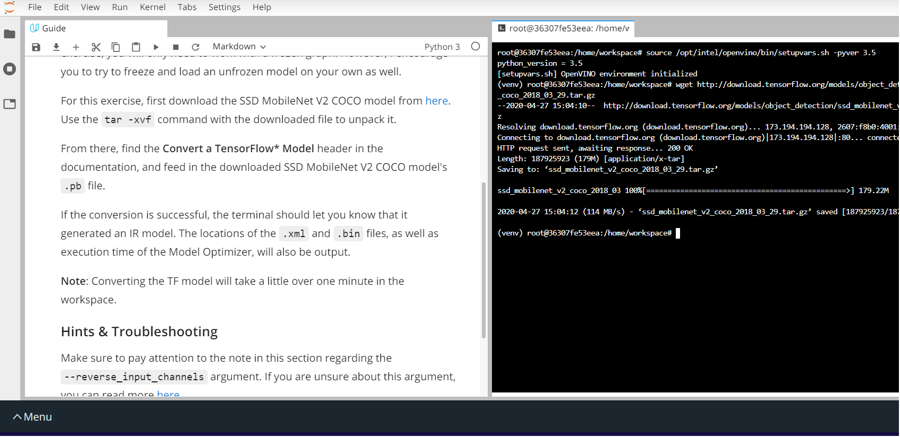
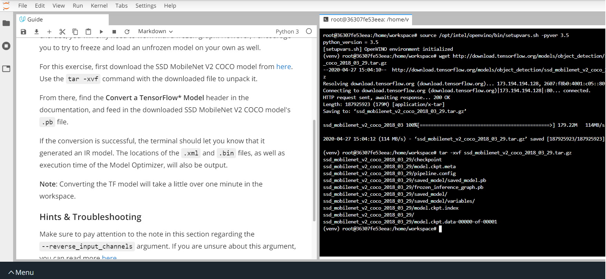

# Project Write-Up

You can use this document as a template for providing your project write-up. However, if you
have a different format you prefer, feel free to use it as long as you answer all required
questions.

## Explaining Custom Layers

The application of Deep Learning had spread beyond our thinking. This was able to happen because of the countless number of data, parameters used to create a layer. Depending on the application needed, these layers are combined to form a model. This helps us to create new model for a specific or multiple operation using custom layers. 

The process behind converting custom layers involves the following. 
* Generate the Extension Template Files Using the Model Extension Generator
* Using Model Optimizer to Generate IR Files Containing the Custom Layer
* Edit the CPU Extension Template Files
* Execute the Model with the Custom Layer

The Two popular pose detection methods are YOLO and SSD. The trade-off between speed and accurary for both the odels  is accompined with the computational power. YOLO model is suitabled for high speed output where the accuracy is not that high, whereas the SSD provides higher accuracy with high speed output for a higher computational time. Here I choose SSD MobileNet V2 COCO model. 
 
* First download the SSD MobileNet V2 COCO model from Tensorflow
'''
wget http://download.tensorflow.org/models/object_detection/ssd_mobilenet_v2_coco_2018_03_29.tar.gz
'''

* Use tar -xvf command and to unpack it.

'''
tar -xvf ssd_mobilenet_v2_coco_2018_03_29.tar.gz
'''

* To covert the TF model, feed in the downloaded SSD MobileNet V2 COCO model's .pb file using the model optimizer.

'''
python /opt/intel/openvino/deployment_tools/model_optimizer/mo.py --input_model frozen_inference_graph.pb --tensorflow_object_detection_api_pipeline_config pipeline.config --reverse_input_channels --tensorflow_use_custom_operations_config /opt/intel/openvino/deployment_tools/model_optimizer/extensions/front/tf/ssd_v2_support.json
'''

 If the conversion is sucessful, you can find the .xml file and .bin file. The Execution Time is about 81.77 seconds.

The Generated IR model files are : 
    * XML file: /home/workspace/ssd_mobilenet_v2_coco_2018_03_29/./frozen_inference_graph.xml
    * BIN file: /home/workspace/ssd_mobilenet_v2_coco_2018_03_29/./frozen_inference_graph.bin

### To run this project, use the following commands:

#### Using  a video file
python main.py -i resources/Pedestrian_Detect_2_1_1.mp4 -m your-model.xml -l /opt/intel/openvino/deployment_tools/inference_engine/lib/intel64/libcpu_extension_sse4.so -d CPU -pt 0.6 | ffmpeg -v warning -f rawvideo -pixel_format bgr24 -video_size 768x432 -framerate 24 -i - http://0.0.0.0:3004/fac.ffm

#### Using a camera stream 
python main.py -i CAM -m your-model.xml -l /opt/intel/openvino/deployment_tools/inference_engine/lib/intel64/libcpu_extension_sse4.so -d CPU -pt 0.6 | ffmpeg -v warning -f rawvideo -pixel_format bgr24 -video_size 768x432 -framerate 24 -i - http://0.0.0.0:3004/fac.ffm

## Comparing Model Performance

My method(s) to compare models before and after conversion to Intermediate Representations
were the following.: 

The difference between model accuracy pre- and post-conversion was that, SSD MobileNet V2 IR detects less no of people with a high accuracy but fails to continuously track subject that is idle. 

The size of the model pre- and post-conversion was almost the same. The SSD MobileNet V2 COCO model .pb file is about 66.4 MB and the IR bin file is 64.1 MB. 

The inference time of the model pre- and post-conversion was 70ms. I tested both pre-trained model and the converted model, where turns out that, the pre-trained model from openzoo had a lesser inference time that the converted model. Also, the detection was so accurate with the pre-trained model. 

## Assess Model Use Cases

Some of the potential use cases of the people counter app are, at the retail to keep a track of the people based on their interest, and at the traffic signal to make sure that people crosses safely.  

Each of these use cases would be useful because, it allows us to improve marketing strategy of the retail and as well as safety of the pedestrian.

## Assess Effects on End User Needs

Lighting, model accuracy, and camera focal length/image size have different effects on a deployed edge model. The potential effects of each of these are as follows. 

* Lighting and Focal Length of the camera depends on the system installed. A bad lighting can seriosly reduces the accuracy of the model. 

* One thing to notice is that, the camera's angle plays an important role that has affects on both the lighting as well as model accuracy. 

* The camera image size should be compatible with the model for proper detection. The model accuracy is calculated using the confusion matrix which gives the details about the occurance of false postivites and negatives which degrades the accuracy of the model. 

## Model Research

[This heading is only required if a suitable model was not found after trying out at least three
different models. However, you may also use this heading to detail how you converted 
a successful model.]

In investigating potential people counter models, I tried each of the following three models:

- Model 1: [Name]
  - [Model Source]
  - I converted the model to an Intermediate Representation with the following arguments...
  - The model was insufficient for the app because...
  - I tried to improve the model for the app by...
  
- Model 2: [Name]
  - [Model Source]
  - I converted the model to an Intermediate Representation with the following arguments...
  - The model was insufficient for the app because...
  - I tried to improve the model for the app by...

- Model 3: [Name]
  - [Model Source]
  - I converted the model to an Intermediate Representation with the following arguments...
  - The model was insufficient for the app because...
  - I tried to improve the model for the app by...
